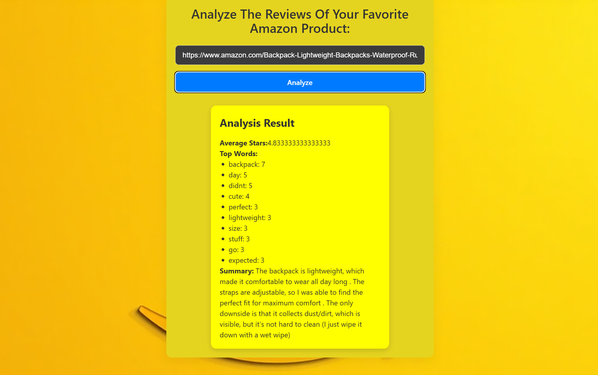

# 🛍️ Amazon Review Analyzer

A full-stack application that scrapes and analyzes Amazon product reviews using NLP. It provides average ratings, top keywords, sentiment analysis, and a smart summary — all powered by Python (Flask) and React.

---

## 🚀 Features

- 🔍 **Web Scraping**: Parses Amazon product reviews in real time
- 📊 **Average Rating**: Extracts and calculates numerical review ratings
- 💬 **Top Words**: Shows most common keywords across reviews
- 🧠 **Sentiment Analysis**: Understands customer sentiment using VADER
- ✂️ **Summarization**: Uses HuggingFace Transformers to summarize all reviews
- ⚡ **Responsive Frontend**: Built with React and served via Flask in a monolithic architecture

---

## 🧠 Tech Stack

| Frontend | Backend | NLP / AI | Dev Tools |
|----------|---------|----------|-----------|
| React.js | Flask   | NLTK, HuggingFace Transformers | Python, Vite, BeautifulSoup, Requests |

i used react.js  to build fast, interactive modern user interface.

I used Flaks to process the review data and communnicate with NLP tools.

I used NLTK to extract meaningfull patterns from raw review text.

I used HuggingFace Transformers for  high-quality abstractive summarization of all reviews.

I used BeautifulSoup to extract structured data from raw HTML pages of Amazon.

---

## Architechture

monolithic architecture where both the frontend and backend are combined into a single deployable unit.

## 🖼️ Screenshots

---

## 🛠️ Setup Instructions

in terminal:

cd server
python server.py

